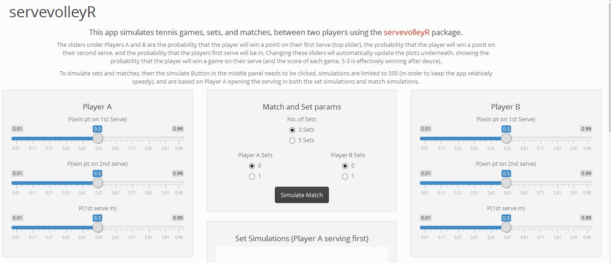

servevolleyR 0.0.1
==================

### Overview

Collection of functions to simulate a tennis point, game, set, tiebreak and match.  

### Installation

```R
devtools::install_github("durtal/servevolleyR")
```

### Help

```R
??servevolleyR
```

Help pages are available [here](http://durtal.github.io/servevolleyR/), a couple of vignettes looking at two matches from Wimbledon 2015 are now available, [Serena Williams vs Maria Sharapova](http://durtal.github.io/servevolleyR/williams-sharapova.html) and [Federer vs Murray](http://durtal.github.io/servevolleyR/federer-murray.html).

### Shiny

I have added a shiny app, I think I've ironed out all the bugs, so this app is available in the master branch (having previously been kept in the shiny branch)

To run the shiny app:

```R
library(servevolleyR)
svRshiny()
```

The shiny app allows users to simulate 1000 service games for two players, 500 sets and 500 matches, a screenshot of the app is shown below:




### Other

Comments/suggestions to improve code, and speed up some of the functions would be welcomed, if possible turning `plyr` code that uses `rlply` and `ldply` into speedier `dplyr` code.
