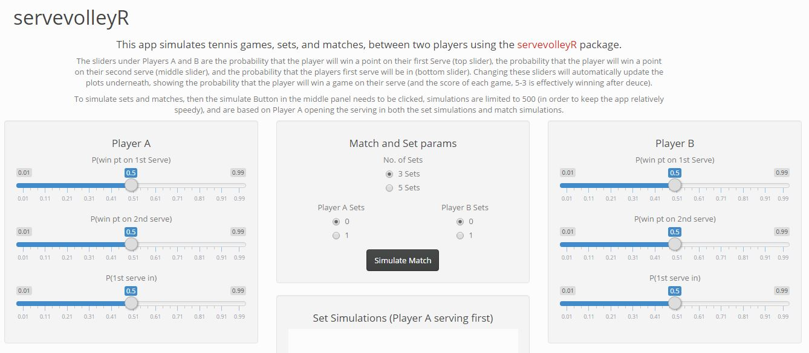

This is a simple, and working (hopefully), shiny app that allows users to use the functions in `servevolleyR` interactively.  Because the functions can sometimes take some time to run, the app is a little slow on occasion, and the rendering of plots is a little clunky (any tips to fix these issues please contribute!).

To launch the app:

```{r eval=FALSE}
svRshiny()
```

The app should look something like:


