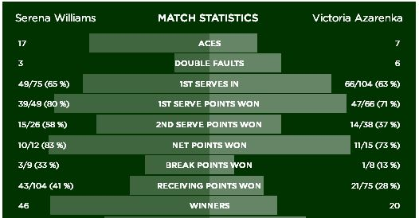

### Williams vs Sharapova

Today sees Serena Williams take on Maria Sharapova in the semi-final of Wimbledon 2015.  This post will walk through an example use of the package using this match-up.

First make sure the package is installed and loaded:

```{r}
# devtools::install_github("durtal/servevolleyR")
library(servevolleyR)
```

What `servevolleyR` requires is a probability that a player will win the point on their first serve.  For this quick example, we'll use the players performance in their last matches.  Williams defeated her sister, Venus, in two sets, with some summary statistics shown in the picture below left, while Sharapova beat Vandeweghe in three sets, with some summary statistics shown in the picture below right.

<div class="row">
<div class="col-sm-6">

</div>
<div class="col-sm-6">

</div>
</div>

The stats show that Serena won 80% of points on her first serve, while Sharapova won 73%.  These two numbers, while very simple can be used to simulate a game, set, tiebreak, and match between the two.  However additional parameters can also be provided, namely, the probability that a player will win a point on their second serve, and the probability that the players first serve will be in.  These can also be seen in the pictures above.  So for the two players (Maria's second serve was woeful!):

```{r}
serena1 <- 0.80     # serena first serve win %
serena2 <- 0.58     # serena second serve win %
serenaIn <- 0.65    # serena first serve in %

maria1 <- 0.73      # maria first serve win %
maria2 <- 0.36      # maria second serve win %
mariaIn <- 0.6      # maria first serve in %
```

We can then use these parameters in the following functions included in `servevolleyR`, [`simGame`](simGame.html), [`simGames`](simGames.html), [`simSet`](simSet.html), [`simSets`](simSets.html), [`simTiebreak`](simTiebreak.html), [`simMatch`](simMatch.html) and [`simMatches`](simMatches.html).

### `simGame` and `simGames`

`simGame` simulates a single service game given a number of parameters, the only one required is the probability that a player wins a point on their first serve, `serena1` and `maria1` above, but additional parameters can also be provided.  To simulate many service games, there are two options, the first, probably quicker is to use `simGame` inside `replicate`, we'll look at Serena for this example, the second is to use `simGames`.

#### Serena service games

Using `simGame` and `replicate`

```{r}
serenaServe <- replicate(1e3, simGame(p = serena1,
                                      p2 = serena2,
                                      firstServe = serenaIn))
```

`serenaServe` is a vector of `r length(serenaServe)` service game results, **1** when the server (Serena) wins, and **0** when the returner wins, the first 6 results are `r head(serenaServe)`.  This vector can be summarised as follows.

```{r}
table(serenaServe) / sum(table(serenaServe))
```

The simulation estimates that Serena will win `r (table(serenaServe) / sum(table(serenaServe)))[[2]]` of her service games.

#### Maria service games

Using `simGames`

```{r}
mariaServe <- simGames(n = 1e3,                # number of simulations
                       p = maria1,
                       p2 = maria2,
                       firstServe = mariaIn)
```

<div class="row">
<div class="col-sm-6">

The benefit of using `simGames` isn't speed, but detail, `simGames` returns a list with detailed data about the simulated games, data that includes the number of points each player won in a service game.  The list has a class of **`r class(mariaServe)[2]`**, which comes with a few methods, such as `print`, `summary` and `plot`, the print method is shown below.  While the plot method can be seen to the right, it shows the probability that Maria will win her service game (`r mariaServe$results$pct`), as well as the scores in the service games, 0 corresponds to _love_, 1 to 15, so the score 4-2 is W-30, 5-3 is winning after deuce:

```{r}
mariaServe
```

</div>
<div class="col-sm-6">

```{r fig.align="center"}
plot(mariaServe)
```

</div>
</div>

### `simSet` and `simSets`

`simSet` simulates a single set given a number of parameters for two players, the only two required is the probability that each player wins a point on their first serve, `serena1` and `maria1` above, but additional parameters can also be provided.  To simulate many service games, there are two options, the first, probably quicker is to use `simSet` inside `replicate`, we'll just use `simSets`.

Another thing worth bearing in mind is that player A opens the serving.

```{r}
serenaSets <- simSets(n = 1e3, playTiebreak = TRUE, players = c("Serena", "Maria"),
                      pA = serena1, p2A = serena2, firstServeA = serenaIn,
                      pB = maria1, p2B = maria2, firstServeB = mariaIn)
```


<div class="row">
<div class="col-sm-6">

Like `simGames`, it is likely slower than using `replicate` and `simSet`, however the list returned by `simSets` has much more detail about the simulated Sets.  The list has a class of **`r class(serenaSets)[2]`**, which comes with a few methods, such as `print`, `summary`, and `plot`.  The summary method is shown below.  While the plot method is shown to the right, showing the probability that player A will win the set (`r serenaSets$results$pct`), as well as the probability for each potential set score:

```{r}
summary(serenaSets)
```

</div>
<div class="col-sm-6">

```{r fig.align="center"}
plot(serenaSets)
```

</div>
</div>

The list returned by `simSets` can be converted into a dataframe for further analysis, this dataframe effectively contains data about simulated service games, thereby not requiring the use of `simGames`.  To convert this to a dataframe simply use the [`simDf`](simDf.html) function, it can sometimes take some time to convert the data, the larger the number of simulations the longer it takes:

```{r}
serenaSetsDf <- simDf(serenaSets)
head(serenaSetsDf)
```

### `simMatch` and `simMatches`

These two functions follow the same convention as those above, and require parameters for two players, and a few details about the type of match they are playing, ie. how many sets, play tiebreaks, etc.

I'll just use `simMatches` here, with Serena opening the serving.

```{r}
serenaMatch <- simMatches(n = 1e3, sets = 3, finalSetTiebreak = TRUE,
                          players = c("Serena", "Maria"), tiebreaks = TRUE,
                          pA = serena1, p2A = serena2, firstServeA = serenaIn,
                          pB = maria1, p2B = maria2, firstServeB = mariaIn)
```

<div class="row">
<div class="col-sm-6">

Like the previous two functions, `simGames` and `simSets`, it is likely slower than using `replicate` and `simMatch`, but the detail is much better, getting data about the matches, sets, and games in each simulation.  The list returned has a class of **`r class(serenaMatch)[2]`**, which comes with `print`, `summary`, and `plot` methods.  The summary method is shown below, while the plot to the right shows the probability of Player A winning the match (`r serenaMatch$results$pct`), as well as the final scores.

```{r}
summary(serenaMatch)
```

</div>
<div class="col-sm-6">

```{r fig.align="center"}
plot(serenaMatch)
```

</div>
</div>

<div class="row">
<div class="col-sm-6">


Sharapova's second serve % will need to be much improved if she is to get close to Serena.  Simulating a match between the two using just their first serves makes the match much closer:

```{r}
FirstServes <- simMatches(n = 1e3, sets = 3, finalSetTiebreak = TRUE,
                          players = c("Serena", "Maria"), tiebreaks = TRUE,
                          pA = serena1, pB = maria1)
```

</div>
<div class="col-sm-6">

```{r fig.align="center"}
plot(FirstServes)
```

</div>
</div>

This list can also be converted to a dataframe for further analysis using the [`simDf`](simDf.html) function.